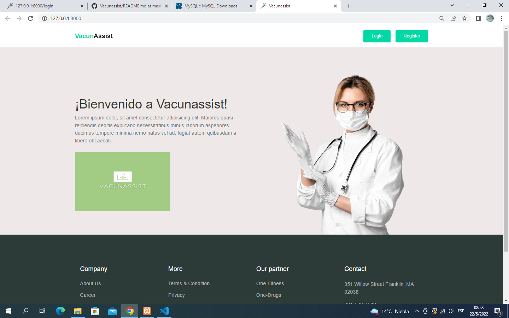
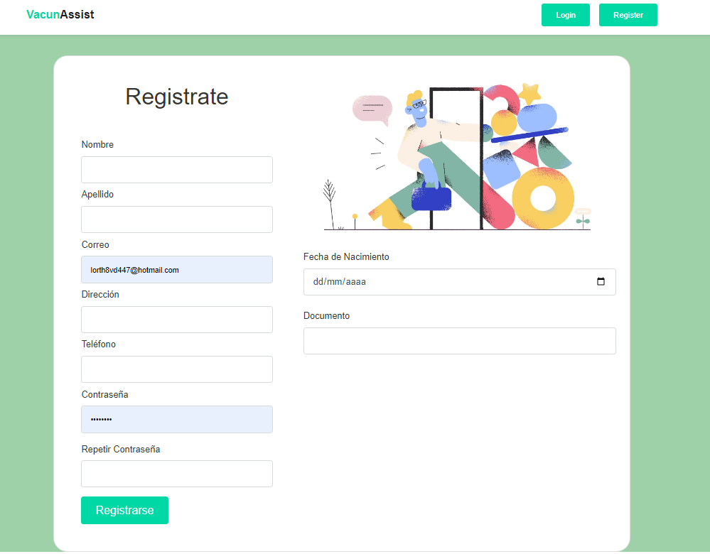
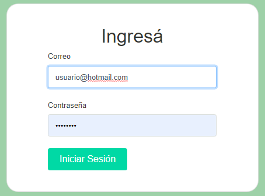
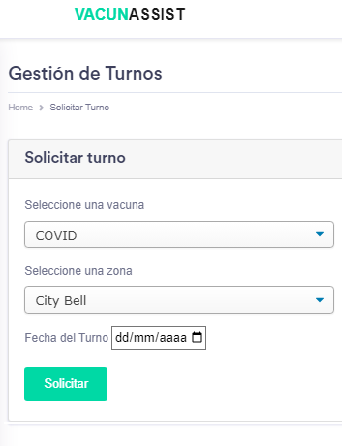
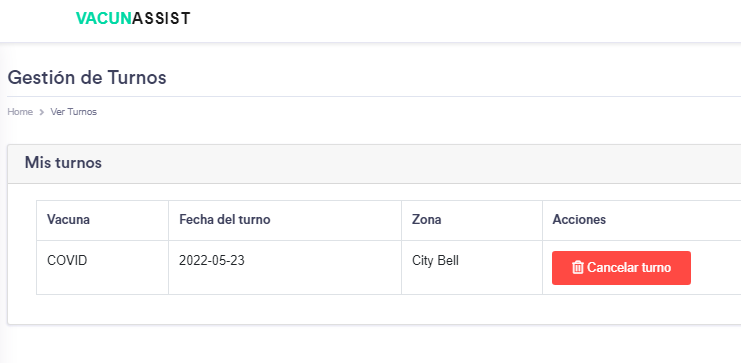
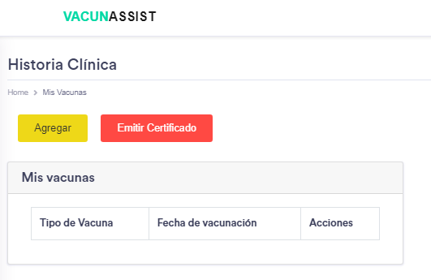
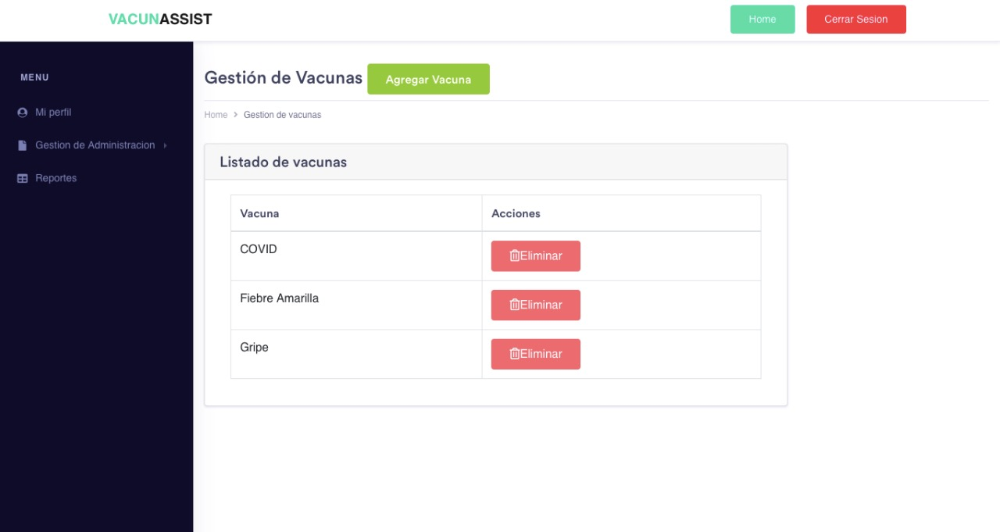
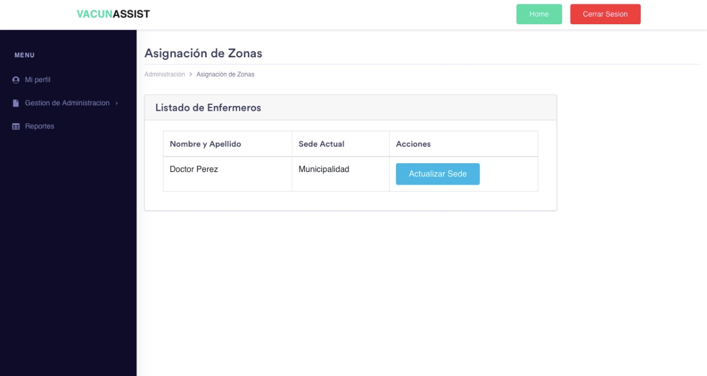
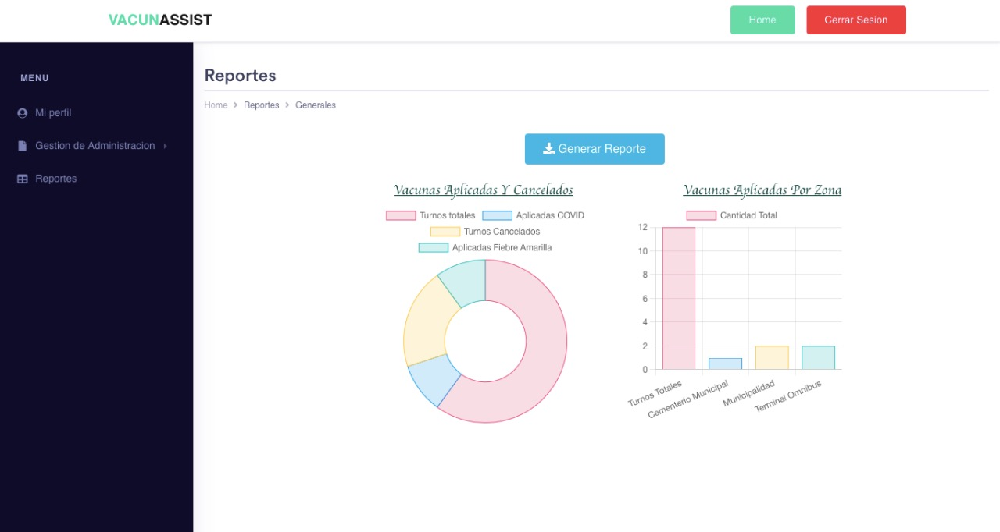

# Bienvenide VacunAssist :syringe: !

## Instrucciones de uso: 
1) Para ejecutar la aplicación necesitás tener instalado XAMPP PHP y MySql server: 
    + *[Descargar PHP ](https://www.php.net/downloads.php)*   
    + *[Descargar XAMPP ](https://xampp.uptodown.com/windows)*   
    + *[Descargar MySQL ](https://www.mysql.com/downloads/)*   

 Una vez instalado todo, deberías ejecutar ***php artisan serve*** para poder acceder a tu local host y  ver una pantalla como la siguiente:  
   

Para poder configurar las tablas de la base de datos se deberán ejecutar los siguientes comandos

php artisan db:wipe   
php artisan migrate   

A través de la portada inicial se podrá acceder al registro o login de usuario 

   

   

Una vez logeado se podrá acceder a las funcionalidades de VacunAssist.
- [x] Solicitar turno.
- [x] Cancelar turno.
- [x] Ver turnos pendientes.
- [x] Historia clínica y emisión de certificado.
- [x] Edición de datos personales.

   
   
   

A través de la portada inicial tabién se podrá acceder al registro o login del enfermero 

Una vez logeado se podrá acceder a las funcionalidades de VacunAssist.

- [x] Ver turnos pendientes.
- [x] Registrar vacuna aplicada.
- [x] Registrar ausencia.
- [x] Generar turno automático.

Al igual que el usuario paciente y enfermero, el adminsitrativo ya registrado en el sistema podrá acceder a VacunAssist para implementar las siguientes funcionalidades.

- [x] Actualizar sede del usuario enfermero.
- [x] Cargar vacunas en el sistema.
- [x] Eliminar vacunas.
- [x] Autorizar turno de fiebre amarilla.
- [x] Generar reportes, varios.

   
   
   

**Gracias**  

### *-[Sofía, Santiago, Lorena]-* 
### &ensp;&ensp;&ensp;&ensp;&ensp; -[2022]-

*Aplicación creada para la cátedra de Ingeniería 2 , Universidad Nacional de La Plata.-*
